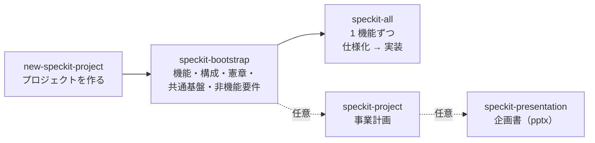

# 利用マニュアル

my-speckit-scaffold のコマンドとスキルの使い方をまとめた、利用者向けの説明書。仕組みや設計の詳細は [README.md](README.md) と各スキルの `SKILL.md` にある。

## 目次

1. [全体の流れ](#1-全体の流れ)
2. [準備](#2-準備)
3. [最小の手順（新しいプロジェクトを作って実装まで）](#3-最小の手順新しいプロジェクトを作って実装まで)
4. [立ち上げ（speckit-bootstrap）](#4-立ち上げspeckit-bootstrap)
5. [仕様化と実装（speckit-all / speckit-feature / speckit-coding）](#5-仕様化と実装speckit-all--speckit-feature--speckit-coding)
6. [事業計画（speckit-project）](#6-事業計画speckit-project)
7. [企画書（speckit-presentation）](#7-企画書speckit-presentation)
8. [エージェントごとの呼び出し方](#8-エージェントごとの呼び出し方)
9. [scaffold の更新を取り込む（new-speckit-project update）](#9-scaffold-の更新を取り込むnew-speckit-project-update)
10. [Windows で使う場合](#10-windows-で使う場合)
11. [困ったとき](#11-困ったとき)
12. [早見表](#12-早見表)

---

## 1. 全体の流れ



- **new-speckit-project**: scaffold から新しいプロジェクトを作り、AI エージェントを起動する。
- **speckit-bootstrap**: エージェントとの対話で、コアコンセプトから機能の一覧、アーキテクチャ、憲章、共通基盤、非機能要件までを作る。
- **speckit-all**: 機能を 1 件ずつ、仕様化から実装、レビュー、`main` へのマージまで進める。
- **speckit-project**（任意）: 市場規模、収支、KPI、スケジュールなどの事業計画を作る。
- **speckit-presentation**（任意）: 成果物から企画書の PowerPoint を作る。

どのスキルも、決める必要があることはエージェントが選択肢と推奨案を示して質問する。答えながら進めればよい。

## 2. 準備

### 必要なもの

| もの | 用途 | 入れ方の例 |
|---|---|---|
| Git | バージョン管理 | macOS: `xcode-select --install`、Windows: [Git for Windows](https://gitforwindows.org/) |
| Python 3.9 以上 | スクリプトの実行 | macOS / Windows: [python.org](https://www.python.org/downloads/) など |
| uv | コマンドの導入、企画書の生成 | [uv のインストール手順](https://docs.astral.sh/uv/getting-started/installation/) |
| AI エージェントの CLI | 対話で作業を進める | Claude Code、Codex CLI、Antigravity、Kiro CLI、opencode のいずれか 1 つ以上 |

Git には名前とメールアドレスを設定しておく。

```bash
git config --global user.name "あなたの名前"
git config --global user.email "あなたのメールアドレス"
```

### コマンドを入れる（初回だけ）

```bash
uv tool install "git+https://github.com/sfukuda84/my-speckit-scaffold#subdirectory=tool"
```

`new-speckit-project --version` で版が表示されれば完了。新しい版にするときは次のコマンドを使う。

```bash
uv tool upgrade new-speckit-project
```

## 3. 最小の手順（新しいプロジェクトを作って実装まで）

### ステップ 1: プロジェクトを作る

```bash
new-speckit-project ~/work/my-app -m "小規模な美容室向けの予約管理サービス。電話と LINE の予約を 1 画面で管理し、ダブルブッキングを防ぐ。"
```

- `~/work/my-app` は作るプロジェクトのディレクトリ（存在しないか、空であること）。
- `-m` はサービスのコアコンセプト。誰の、どんな課題を、どう解決するかを書く。省くと、実行後に入力を求められる。
- 既定では Claude Code が起動する。別のエージェントを使うなら `--agent codex` のように指定する（§8）。

### ステップ 2: 立ち上げの質問に答える

エージェントが起動し、`speckit-bootstrap` が自動で始まる。エージェントの質問に答えていくと、次の順に成果物ができる（詳しくは §4）。

1. 機能の一覧（`docs/feature/`）
2. アーキテクチャと技術選定（`docs/architecture.md`）
3. 憲章（`.specify/memory/constitution.md`）
4. 共通基盤（`docs/feature/000-app-basic.md`）
5. 非機能要件（`docs/nfr.md`、`docs/feature/999-app-nfr.md`）

終わると「次は `speckit-all` で進める」と案内される。

### ステップ 3: すべての機能を仕様化して実装する

同じエージェントで、次のように依頼する（Claude Code の場合）。

```text
/speckit-all all
```

`000-app-basic` から着手順に 1 件ずつ、仕様化 → 実装 → レビュー → `main` へのマージを繰り返す。途中でエージェントが質問してきたら答える。1 件ずつ進めたいときは `/speckit-all`（引数なし）で次の 1 件だけを進める。

> 途中で止まっても、もう一度 `/speckit-all all` を実行すれば、止まったところから続きを始める（§5）。

## 4. 立ち上げ（speckit-bootstrap）

`new-speckit-project` が自動で始めるが、手動で始めるときは `/speckit-bootstrap` と打つ。

| ステップ | 何をするか | 主に聞かれること | 成果物 |
|---|---|---|---|
| B1 機能への仕分け | コンセプトを、仕様化できる大きさの機能に分ける。競合も調べる | 利用者、主な業務の流れ、MVP の範囲、課金の方針、やらないこと | `docs/feature/001-*.md` ほか、`docs/concept/competitor.md`、`backlog.md` |
| B2 アーキテクチャ | SaaS/PaaS・クラウド・VPS の 3 案を月額の概算付きで比べ、選ぶ | 使いたいクラウド、予算、運用の体制、得意な言語 | `docs/architecture.md` |
| B3 憲章 | すべての判断の基準になる原則を決める | テストの方針など | `.specify/memory/constitution.md` |
| B4 共通基盤 | 認証やメール送信など、どのサービスにも要る機能をまとめる | MVP に入れる共通機能 | `docs/feature/000-app-basic.md` |
| B5 非機能要件 | 稼働率、応答時間、セキュリティ、監視、バックアップなどの目標を決める | 可用性やコストの目標 | `docs/nfr.md`、`docs/feature/999-app-nfr.md` |
| B6 検証 | 全体の食い違いがないか確かめる | — | — |

- ステップごとにコミットされるので、途中でやめても `/speckit-bootstrap` を再実行すれば続きから始まる。
- 番号 `000` は共通基盤、`999` は運用基盤の予約番号で、コアの機能は `001` から振られる。

## 5. 仕様化と実装（speckit-all / speckit-feature / speckit-coding）

### 3 つのスキルの違い

| スキル | 範囲 | 使う場面 |
|---|---|---|
| `speckit-all` | 仕様化から実装、マージまで通しで | 普段はこれを使う |
| `speckit-feature` | 仕様化まで（specify、clarify ×2、plan、tasks、analyze ×3）して `main` にマージ | 仕様だけ先に固めて、レビューや承認を挟みたいとき |
| `speckit-coding` | 実装から（implement、converge、レビュー ×2）して `main` にマージ | `speckit-feature` で仕様をマージした機能を実装するとき |

### 引数

| 指定 | 例 | 動き |
|---|---|---|
| なし | `/speckit-all` | 次に着手すべき 1 件 |
| 番号 | `/speckit-all 3` または `/speckit-all 003` | その 1 件 |
| 範囲 | `/speckit-all 002-005` | 範囲内を 1 件ずつ順に |
| すべて | `/speckit-all all` | 残りをすべて 1 件ずつ順に |
| 自動 | `/speckit-all all --auto` | 上と組み合わせる。質問せずに、エージェントの推奨案を採用して進める |

着手の順番は `docs/feature/spec_order.md` の並び順に従う。

### 自動モード（`--auto`）

`--auto` を付けると、clarify の質問、設計判断、レビュー指摘の対応方針などを質問せずに、エージェントが示す推奨案を採用して進める。`speckit-feature` と `speckit-coding` でも使える。

- 自動で決めたことは、機能ごとに `specs/<番号-名前>/auto-decisions.md` に記録される。clarify の回答には `(auto)` の印が付く。終わったら一覧を見直し、変えたいものは `/speckit-clarify` などで直す。
- マージの競合、中止、憲章やアーキテクチャの変更が必要な場合、テストが直らない場合などは、自動モードでも止まる。範囲指定や `all` では、止まった機能（とそれに依存する機能）を飛ばして次に進み、最後に判断してほしい事項を報告する。判断した後にもう一度実行すれば、続きから再開する。

### 作業の場所

機能ごとに `.worktrees/<番号-名前>`（ブランチ `feature/<番号-名前>`）という別の作業ディレクトリを作って作業し、終わったら `main` にマージして片付ける。普段の作業ディレクトリ（`main`）は、作業中も汚れない。

### 中断と再開

- 各ステップが終わるたびにコミットして、進捗を記録している。
- エージェントを閉じても、別のエージェントに替えても、同じスキルを再実行すれば、止まったステップから続きを始める。再開する前に、どこから再開するかの確認がある。

### 進捗を見る・やめる

エージェントに「フィーチャーの進捗を見せて」と頼むか、スクリプトを直接実行する。

```bash
python3 .claude/skills/speckit-worktree/scripts/worktree_helper.py status
```

```text
| FEATURE | 仕様 | 実装 | WORKTREE |
|---|---|---|---|
| 000-app-basic | 完了 | 完了 | - |
| 001-salon-setup | 完了（未マージ） | 作業中 | あり（次: S10） |
| 002-customer-records | 未着手 | - | - |
```

作業中の機能をやめて捨てるときは、エージェントに「001 の作業を破棄して」と頼む（確認のうえで破棄される）。

### マージの前に確認されること

最後のマージ（片付け）の前に、次の場合は止まって確認を求められる。

| 表示 | 意味 | どうするか |
|---|---|---|
| `UNCHECKED_TASKS` | `tasks.md` に終わっていないタスクがある | 実装するか、残したままマージするかを答える |
| `LEFTOVER_CHANGES` | どのステップにも含まれない変更がある | マージに含めてよいかを答える |
| `NOT_ON_MAIN` | 普段の作業ディレクトリが `main` 以外のブランチにいる | `main` に切り替えてよいかを答える |

マージのときに、作業ディレクトリにあった `.env` などの無視対象のファイルも消える。消えるファイルは報告されるので、必要なら控えておく。

## 6. 事業計画（speckit-project）

市場規模、価格と収支、KPI、スケジュール、体制、リスクをまとめ、`docs/project.md` に書く。企画書の材料になる。

### 使い方

```text
/speckit-project
```

立ち上げ（§4）の後に実行すると、機能の一覧と構成の費用を使って計画を作れる。重点を置きたいことがあれば、引数で伝える（例: `/speckit-project 資金調達を前提にしたい`）。

### 聞かれること

- 計画の期間と、目指す姿（例: 3 年で黒字の小規模サービス）
- 価格（競合の価格帯を示して、候補を提案される）
- 体制（誰が、週何時間関わるか）と人件費の扱い
- 顧客数の見込み（楽観・標準・悲観）、広告などの費用、初期投資
- 必要資金の調達方法
- KPI と、見直し・撤退の基準

市場規模などの客観的な数字は、エージェントが Web で調べて出典と参照日を付ける。

### できるもの

`docs/project.md` に、市場規模（TAM・SAM・SOM）、価格、3 シナリオの収支表、必要資金、KPI、工数とマイルストーン、体制、リスクが書かれる。

### 収支の前提を自分で直す

収支表は手で書かず、前提の表から計算する。前提を直したいときは、`docs/project.md` の `json speckit-plan` のブロック（単価、顧客数の推移、費用など）を書き換えて、次のコマンドで計算し直す。

```bash
python3 .claude/skills/speckit-project/scripts/plan.py docs/project.md --write   # 収支表を計算し直す
python3 .claude/skills/speckit-project/scripts/plan.py docs/project.md --check   # 前提と収支表が一致しているか確かめる
```

前提の書き方:

| 項目 | 意味 |
|---|---|
| `revenue[].unit_price` | 月額の単価 |
| `revenue[].volume` | 期ごとの平均の数量（例: 平均の有料店舗数） |
| `costs[].monthly` | 期ごとの月額の固定費（インフラ、人件費など） |
| `costs[].per_period` | 期ごとにかかる費用（広告、外注など） |
| `costs[].rate` | 売上に対する率（決済手数料など。0.036 は 3.6%） |
| `initial_investment` | 初期投資 |

計画の内容を見直したいときは、`/speckit-project` をもう一度実行する（更新モードになり、変える部分を確認しながら直す）。

## 7. 企画書（speckit-presentation）

成果物から、読み手に合わせた企画書を PowerPoint（.pptx）で作る。事前に `speckit-project` で `docs/project.md` を作っておく。

### 使い方

```text
/speckit-presentation internal
```

| 読み手 | 用途 | 厚くなる内容 |
|---|---|---|
| `internal` | 社内の承認 | 費用、リスク、スケジュール、判断基準 |
| `investor` | 投資家・資金調達 | 市場、成長、収益性 |
| `customer` | 顧客・パートナー | 課題、価値、使い方、価格 |

目的、発表時間、発表で使うか配布するかを聞かれ、スライドの構成案が示される。了承すると作成される。

### できるもの

```text
docs/presentation/
├── design.yaml               # 見た目（色、フォント、雛形）。読み手ごとの版で共通
└── internal/
    ├── slides.md             # スライドの内容と発表者ノート
    └── proposal.pptx         # 企画書
```

### 内容を直す

**pptx を PowerPoint で直接直さない。** pptx は `slides.md` と `design.yaml` から作り直すので、直接直した内容は次に作り直したときに消える。

- エージェントに頼む: 「internal の企画書の 5 枚目を、〜という主張に変えて」
- 自分で直す: `slides.md` を編集し、次のコマンドで作り直す。

```bash
uv run .claude/skills/speckit-presentation/scripts/build_pptx.py docs/presentation/internal/slides.md --check   # 書式と文字量の確認
uv run .claude/skills/speckit-presentation/scripts/build_pptx.py docs/presentation/internal/slides.md           # pptx を作り直す
```

`slides.md` の書き方の要点:

```markdown
<!-- layout: bullets -->
# 見出しは主張にする（例: 手作業の確認に 1 件 30 分かかる）
- 要点
  - 補足（2 字下げで下位の項目）
> 出典: docs/project.md §2

<!-- notes
発表者ノート。スライドに書ききれない説明を書く。
-->

---

<!-- layout: stats -->
# 対象の市場は年 15.7 万件
- **27.3万件** TAM
- **15.7万件** SAM
```

スライドは `---` だけの行で区切る。使えるレイアウトは `title`（表紙）、`section`（章の扉）、`bullets`（箇条書き）、`two-column`（2 段組み）、`table`（表）、`stats`（数値の強調）、`chart`（グラフ）、`image`（画像）、`message`（1 文のメッセージ）。詳しくは `skills/speckit/speckit-presentation/SKILL.md` の §4 と、`templates/slides.md` の見本を見る。

### 色とフォントを変える

`docs/presentation/design.yaml` を編集して作り直す。

```yaml
fonts:
  latin: Arial            # 英数字のフォント
  east_asian: Meiryo      # 日本語のフォント
colors:
  primary: "1F3A5F"       # 見出し、表の見出し行、表紙の背景
  accent: "E07A1F"        # 強調の線、箇条書きの記号
footer:
  text: "社外秘"           # 2 枚目以降の下に入る
logo: images/logo.png     # 右上に入るロゴ（design.yaml からの相対パス）
```

フォントは、開く PC に入っているものにする。Windows と Mac の両方で開くなら Meiryo か Yu Gothic が無難である。

### 会社のテンプレート（雛形の pptx）に差し替える

会社やブランドの PowerPoint の雛形（背景、ロゴ、スライドマスター）を使って作れる。

**1. 雛形を置く**

雛形の .pptx を `docs/presentation/` の下に置く（例: `docs/presentation/templates/brand.pptx`）。

**2. 使うレイアウトの名前を調べる**

雛形の中のスライドレイアウト（「白紙」「タイトルのみ」など）の名前を一覧にする。

```bash
uv run --no-project --with python-pptx python -c "from pptx import Presentation; [print(l.name) for l in Presentation('docs/presentation/templates/brand.pptx').slide_layouts]"
```

背景とロゴだけが入った、文字の枠がないレイアウト（「白紙」など）を選ぶ。

**3. design.yaml に指定する**

```yaml
template: templates/brand.pptx     # design.yaml からの相対パス
template_layout: 白紙               # 手順 2 で調べた名前。省くと、文字の枠が最も少ないレイアウトを使う
```

**4. 作り直す**

```bash
uv run .claude/skills/speckit-presentation/scripts/build_pptx.py docs/presentation/internal/slides.md
```

雛形を使うときの動き:

- スライドの大きさは雛形に合わせる（`design.yaml` の `slide` は使わない）。
- 背景は雛形のものを使い、`design.yaml` の背景色は描かない。表紙と章の扉の文字は、見出しの色（`primary`）で描く。
- 雛形にもともと入っているスライドは取り除かれる。
- 文字の色、フォント、大きさは `design.yaml` の値を使う。雛形の色に合わせたいときは、`colors` をそろえる。

エージェントに「会社の雛形 docs/presentation/templates/brand.pptx を使って作り直して」と頼んでもよい。

### 読み手を増やす


`/speckit-presentation investor` のように別の読み手で実行すると、`docs/presentation/investor/` に別の版ができる。`design.yaml` は共通で使われる。

## 8. エージェントごとの呼び出し方

| エージェント | 起動（new-speckit-project の指定） | スキルの呼び出し方 |
|---|---|---|
| Claude Code | `--agent claude`（既定） | `/speckit-all all` |
| Codex CLI | `--agent codex` | `$speckit-all all` |
| Antigravity | `--agent agy` | `/speckit-all all` |
| Kiro CLI | `--agent kiro` | 「`speckit-all` スキルで all を進めて」と依頼する |
| opencode | `--agent opencode` | 「`speckit-all` スキルで all を進めて」と依頼する |

- エージェントを起動せずに準備だけしたいときは、`--no-launch` を付ける。表示される手順に従って、好きなエージェントで始める。
- Codex を手で起動する場合は、`.git` への書き込み、Web 検索、ネットワークの許可が要る（[README.md](README.md) の「注意点」）。

## 9. scaffold の更新を取り込む（new-speckit-project update）

scaffold にスキルの追加や修正があったとき、作成済みのプロジェクトに取り込める。

```bash
uv tool upgrade new-speckit-project          # コマンド自体を新しくする
cd ~/work/my-app
new-speckit-project update --dry-run         # 何が変わるかだけを見る
new-speckit-project update                   # 取り込んで、1 つのコミットにする
```

- `main` ブランチで、未コミットの変更がない状態で実行する。
- 取り込むのは scaffold の持ち物だけである。
  - スキル（`skills/speckit/` と各エージェントのリンク）
  - Spec Kit のスクリプトとテンプレート
  - ルール（`.kiro/steering/`、`CLAUDE.md`、`AGENTS.md`、`GEMINI.md`、`opencode.json`）
  - `MANUAL.md`、`docs/speckit-scaffold.md`
  - `.gitignore` の足りない行
- 取り込まないもの（プロジェクトの持ち物）は次のとおりで、触らない。
  - `docs/concept/`、`docs/feature/`、`docs/*.md` の成果物
  - `specs/`、憲章、ソースコード、`README.md`
- **手で直したファイルは上書きしない。** scaffold のどの版とも中身が一致しないファイルは、手で直したものとみなして残す。scaffold の新しい版は `.scaffold-new/` に置かれるので、比べて必要な部分を取り込む。

  ```bash
  git diff --no-index .kiro/steering/language.md .scaffold-new/.kiro/steering/language.md
  ```

- scaffold から消えたファイルは、手で直していなければ削除する。プロジェクトで独自に足したスキルなど、scaffold に一度も現れていないファイルは残す。
- 作業中の worktree（`speckit-all` などの途中）がある場合、worktree の中のスキルは、`main` にマージするまで更新前のままである。区切りのよいところで取り込むのがよい。
- 取り込んだ版は `.specify/scaffold.json` に記録される。元に戻すときは、更新のコミットを `git revert` する。

## 10. Windows で使う場合

- コマンドは PowerShell でも動く。`new-speckit-project` の使い方は同じ。
- `python3` がない場合は、`python` または `py -3` に読み替える。エージェントは自動で読み替える。

  ```powershell
  py -3 .claude\skills\speckit-worktree\scripts\worktree_helper.py status
  ```

- スキルはシンボリックリンクで共有している。**開発者モード**（設定 → システム → 開発者向け）を有効にしておくとよい。有効でない場合、`new-speckit-project` はスキルを実体のコピーに切り替えて警告を出す。その場合、スキルを更新するときは各エージェントのスキルディレクトリにも反映する必要がある。

## 11. 困ったとき

| 症状 | 原因と対処 |
|---|---|
| `new-speckit-project` で clone に失敗する | ネットワークに接続できるか、`--ref` に指定したブランチやタグがあるかを確かめる |
| `git の user.name と user.email が設定されていません` | §2 の `git config --global` を実行する |
| `speckit-coding` が `SPEC_MISSING` で止まる | 仕様がまだない。先に `speckit-feature` か `speckit-all` を使う |
| `speckit-feature` が `CODING_IN_PROGRESS` で止まる | その機能は実装の途中まで進んでいる。`speckit-coding` か `speckit-all` で再開する |
| マージで競合した | エージェントに競合の内容を確認してもらい、解消方針を答える。解消後にもう一度 `speckit-all` を実行すると、片付けから再開する |
| `ブランチ main がありません` | 既定のブランチが別の名前。環境変数 `SPECKIT_MAIN_BRANCH` にその名前を指定する |
| 企画書で文字があふれる | `build_pptx.py --check` の警告を見て、文を短くするかスライドを分ける。上限は `design.yaml` の `limits` で変えられる |
| 企画書の日本語が明朝体になる | 開いた PC に `design.yaml` のフォントがない。入っているフォントに変えて作り直す |
| Codex がコミットできない、Web を調べられない | サンドボックスの設定が足りない。`new-speckit-project --agent codex` で起動するか、README の「注意点」の指定で起動する |

## 12. 早見表

### コマンド

| コマンド | 用途 |
|---|---|
| `uv tool install "git+https://github.com/sfukuda84/my-speckit-scaffold#subdirectory=tool"` | コマンドを入れる |
| `uv tool upgrade new-speckit-project` | コマンドを更新する |
| `new-speckit-project <ディレクトリ> [-m "コンセプト"] [--agent <名前>] [--no-launch]` | プロジェクトを作る |
| `new-speckit-project update [プロジェクト] [--dry-run]` | 作成済みのプロジェクトに scaffold の更新を取り込む |

### スキル（Claude Code の書き方）

| スキル | 用途 |
|---|---|
| `/speckit-bootstrap` | 立ち上げ（機能、構成、憲章、共通基盤、非機能要件） |
| `/speckit-all [番号 \| 範囲 \| all] [--auto]` | 仕様化から実装、マージまで（`--auto` で質問せずに推奨案を採用） |
| `/speckit-feature [番号 \| 範囲 \| all]` | 仕様化まで |
| `/speckit-coding [番号 \| 範囲 \| all]` | 実装から |
| `/speckit-project` | 事業計画 |
| `/speckit-presentation <internal \| investor \| customer>` | 企画書 |
| `/speckit-worktree status` | 進捗の確認 |
| `/speckit-concept-2-feature --backlog` | 見送った候補（backlog）を機能にする |
| `/speckit-architecture`、`/speckit-common-feature`、`/speckit-nfr-feature` | 立ち上げの各ステップを個別に見直す |
