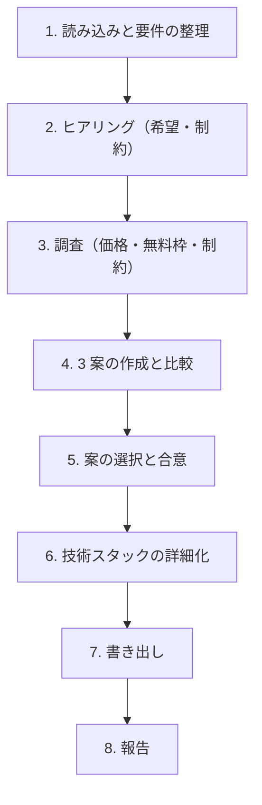

# speckit-architecture スキル（機能一覧 → アーキテクチャと技術選定）

`docs/feature/` の機能一覧を実現するためのシステム構成と技術スタックを決め、`docs/architecture.md` に書く。ここで決めた内容は、憲章（`speckit-constitution`）、共通基盤（`speckit-common-feature`）、非機能要件（`speckit-nfr-feature`）、各機能の `plan.md` の前提になる。

## 0. 大原則

- **推測で決めない。** 技術選定の根拠にしてよいのは、(a) concept と機能概要に書かれた要件、(b) ユーザーの回答、(c) 出典付きの調査結果の 3 つだけ。
- **3 系統を必ず比べる。** SaaS/PaaS 中心、クラウド（IaaS とマネージドサービス）中心、VPS 中心の 3 案を作り、ユーザーに選んでもらう。ユーザーが特定のクラウドを希望した場合も、比較の基準として 3 案は示す。
- **MVP は安く作れることを重視する。** MVP 時の月額の概算を必ず出し、VPS など安価な選択肢を案に含める。そのうえで、成長時の月額と、別の系統へ移るときの費用も示す。
- **価格と仕様は変わる。** 価格、無料枠、サービスの仕様には、出典 URL と参照日を付ける。出典のない価格は書かない。
- **書き出す前に合意を取る。** `docs/architecture.md` は、ユーザーが案を選んでから書く。
- ドキュメントは日本語で書く。識別子、サービス名、コマンドは原文のままでよい。

## 1. 引数と入出力

```text
$ARGUMENTS
```

引数は、追加の希望や制約として扱う（例: 「AWS を使いたい」「月 1 万円以内」）。

| 入力 | 用途 |
|---|---|
| `docs/concept/` | サービスの目的、利用者、想定規模 |
| `docs/feature/premises.md` | 前提（P5 外部連携、P6 セキュリティ・法規制、P7 リソース要件、P8 MVP の範囲、P9 課金など）と「共通基盤の候補」 |
| `docs/feature/*.md`、`spec_order.md` | 機能一覧と MVP の範囲 |
| `.specify/memory/constitution.md` | すでにある場合は、その原則に従う |

| 出力 | 役割 |
|---|---|
| `docs/architecture.md` | 採用した構成、技術スタック、比較した案と却下した理由、費用、見直しの条件、出典。様式は [templates/architecture.md](./templates/architecture.md) |

`docs/architecture.md` がすでにある場合は、**見直しモード**として §4 に従う。

## 2. 手順



### ステップ 1: 読み込みと要件の整理

入力を読み、アーキテクチャに効く要件を整理する。この段階では決めない。

- 利用者の種類と想定規模（利用者数、同時接続、データ量、成長の見込み）
- 機能から見た技術要件: 認証の方式、リアルタイム性、ファイル保存、バッチや定期処理、検索、外部連携（決済、メール、カレンダーなど）、オフライン、モバイル対応
- 法規制と個人情報: データの保管場所（国内保管の要否）、保存期間、暗号化の要否
- MVP の範囲と、最初に有料提供するまでの期間

### ステップ 2: ヒアリング

AskUserQuestion で、次の項目のうち concept や premises で決まっていないものを聞く。1 ラウンド最大 4 問、推奨案を先頭に `(Recommended)` を付けて置く。

| ID | 項目 | 例 |
|---|---|---|
| A1 | 使いたい、または避けたいクラウドや SaaS | AWS / Google Cloud / Azure / Vercel / Supabase / 指定なし |
| A2 | MVP 時の月額予算の上限 | 〜5,000 円 / 〜2 万円 / 〜10 万円 / 未定 |
| A3 | 運用の体制 | 専任なし（開発者が兼任）/ 専任あり / 外部委託 |
| A4 | チームのスキルと好みの言語 | TypeScript / Python / Go / Ruby / 指定なし |
| A5 | 想定規模と成長の見込み | 1 年後の利用者数、データ量 |
| A6 | 可用性への期待（MVP 時） | 業務時間中に止まらなければよい / 常時稼働が必要 |
| A7 | データの保管場所と規制 | 国内保管が必要 / 指定なし |
| A8 | ベンダーロックインの許容度 | 許容する / 移行しやすさを重視する |
| A9 | 既存の資産 | 既存のドメイン、アカウント、社内システムとの連携 |

- 回答から新しい論点が出たら、次のラウンドで聞く。
- 回答は `docs/architecture.md` の「前提と制約」に、項目 ID を付けて記録する。

### ステップ 3: 調査

WebSearch と WebFetch で、候補になるサービスの価格、無料枠、主な制約（リージョン、上限、SLA）を調べる。

- 各系統で、アプリの実行環境、データベース、認証、ストレージ、メール送信、監視の候補を調べる。
- 価格は、MVP 時の想定規模と成長時の想定規模の両方で概算する。為替を使う場合は、使ったレートと日付を書く。
- 事実には出典 URL と参照日を付ける。

### ステップ 4: 3 案の作成と比較

次の 3 系統で 1 案ずつ作る。

| 系統 | 例 | 向いている場面 |
|---|---|---|
| **A. SaaS/PaaS 中心** | Vercel / Cloudflare + Supabase / Neon + Resend | 運用の手間を最小にしたい。無料枠で始めたい |
| **B. クラウド中心** | AWS（ECS / Lambda + RDS + Cognito + SES）、Google Cloud（Cloud Run + Cloud SQL） | 成長後の拡張性、細かい制御、既存のクラウド資産がある |
| **C. VPS 中心** | さくらの VPS / ConoHa / Xserver VPS / Hetzner + Docker Compose + PostgreSQL | 月額を固定で安く抑えたい。構成を自分で管理できる |

各案について、次を比べる。

- 構成の概要（実行環境、DB、認証、ストレージ、メール、監視）
- MVP 時と成長時の月額の概算（内訳付き）
- 運用の負荷（パッチ適用、バックアップ、監視を誰がどうするか）
- 拡張性と可用性の上限
- 別の系統へ移るときの費用とロックインの度合い
- 要件とヒアリングの回答に対する適合度と、主なリスク

### ステップ 5: 案の選択と合意

比較表と推奨案（理由付き）を示し、AskUserQuestion で案を選んでもらう。組み合わせ（例: 「C の構成で、認証だけ A の SaaS を使う」）を希望された場合は、その案を作り直して再提示する。合意するまで書き出さない。

### ステップ 6: 技術スタックの詳細化

選ばれた案について、次を決める。判断が分かれるものは質問する。

- 言語、フレームワーク、主要なライブラリ
- データベースと、マイグレーションの方法
- 認証・認可の方式（`premises.md` の「共通基盤の候補」を参照する）
- メール送信、ファイル保存、バッチ・ジョブ、検索
- 監視、ログ、エラー通知、バックアップ
- CI/CD、デプロイの方法、環境（開発、検証、本番）の分け方
- IaC（使う場合）と、秘密情報の管理方法
- テスト、ビルド、リンターのコマンド

### ステップ 7: 書き出し

[templates/architecture.md](./templates/architecture.md) に沿って `docs/architecture.md` を書く。システム構成図は mermaid で描く。

### ステップ 8: 報告

次を日本語で報告する。

- 採用した案と、主な理由
- 技術スタックの要約
- MVP 時と成長時の月額の概算
- 見直しの条件（どうなったら構成を見直すか）
- 次の手順の案内（`speckit-constitution` で憲章を作る。`speckit-bootstrap` の中で実行している場合は、その手順に戻る）

## 3. 記述の規則

- 各機能の詳細な設計（テーブル定義、API の一覧）は書かない。それは各機能の `plan.md` で決める。ここに書くのは、全機能が従う共通の構成と技術の選択である。
- 却下した案も、理由とともに残す。後で見直すときの材料になる。
- 「見直しの条件」には、利用者数、データ量、月額、応答時間などの具体的な基準を書く。

## 4. 見直しモード

`docs/architecture.md` がすでにある場合は、次の手順で見直す。

1. 既存の内容と、見直しのきっかけ（引数、新しい機能、見直しの条件に達したことなど）を確かめる。
2. 変える部分と、その影響（既存の機能の `plan.md`、憲章、`docs/nfr.md`）を示し、合意を取る。
3. 合意した変更だけを反映し、「変更履歴」に日付、変更内容、理由を足す。価格の調査は、日付付きで新しく足す。

## 5. 禁止事項

- 出典のない価格、無料枠、仕様を書くこと
- ユーザーの合意なしに `docs/architecture.md` を書き出す、または上書きすること
- 3 系統の比較を省くこと
- 各機能の詳細設計をここに書くこと
