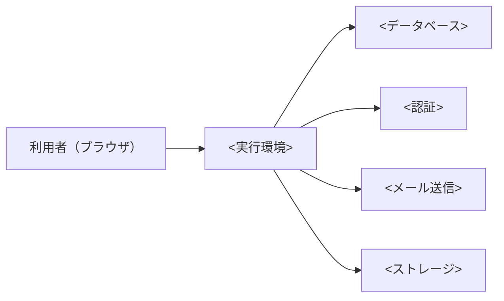

# アーキテクチャ

**最終更新**: <YYYY-MM-DD> | **採用案**: <A / B / C（組み合わせの場合は内容）>

このプロジェクトの全機能が従う、システム構成と技術スタック。各機能の `plan.md` は、この文書と `docs/nfr.md` に従う。変更するときは `speckit-architecture` の見直しモードで行う。

## 1. 前提と制約

### 要件の要約

- **利用者と規模**: <利用者の種類、MVP 時と 1 年後の想定利用者数、データ量>
- **機能から見た技術要件**: <認証、リアルタイム性、ファイル、バッチ、外部連携など>
- **法規制と個人情報**: <保管場所、保存期間、暗号化>
- **MVP の範囲と時期**: <premises P8 の要約>

### ヒアリングの回答

| ID | 項目 | 回答 |
|---|---|---|
| A1 | 使いたい / 避けたいクラウドや SaaS | <回答> |
| A2 | MVP 時の月額予算の上限 | <回答> |
| A3 | 運用の体制 | <回答> |
| A4 | チームのスキルと好みの言語 | <回答> |
| A5 | 想定規模と成長の見込み | <回答> |
| A6 | 可用性への期待（MVP 時） | <回答> |
| A7 | データの保管場所と規制 | <回答> |
| A8 | ベンダーロックインの許容度 | <回答> |
| A9 | 既存の資産 | <回答> |

## 2. 採用した構成

<構成の説明。各要素の役割と、なぜこの構成にしたか。>

## 3. 技術スタック

| 領域 | 採用 | 理由 |
|---|---|---|
| 言語 | <例: TypeScript> | <理由> |
| フレームワーク | <例: Next.js> | <理由> |
| データベース | <例: PostgreSQL（<サービス名>）> | <理由> |
| マイグレーション | <例: Prisma Migrate> | <理由> |
| 認証・認可 | <例: Supabase Auth> | <理由> |
| メール送信 | <例: Resend> | <理由> |
| ファイル保存 | <例: S3 互換ストレージ> | <理由> |
| バッチ・ジョブ | <例: cron / キュー> | <理由> |
| 監視・ログ・エラー通知 | <例: Sentry> | <理由> |
| バックアップ | <方式と頻度> | <理由> |
| CI/CD | <例: GitHub Actions> | <理由> |
| IaC | <使う場合> | <理由> |
| 秘密情報の管理 | <方式> | <理由> |

### 開発のコマンド

| 用途 | コマンド |
|---|---|
| テスト | <コマンド> |
| ビルド | <コマンド> |
| リンター・フォーマッター | <コマンド> |
| ローカル起動 | <コマンド> |

## 4. 環境

| 環境 | 用途 | 構成の違い |
|---|---|---|
| 開発（ローカル） | 開発者の手元 | <例: Docker Compose で DB を起動> |
| 検証 | 本番前の確認 | <例: 本番と同じ構成で最小サイズ> |
| 本番 | 利用者向け | <構成> |

## 5. 費用の概算

参照日: <YYYY-MM-DD>。為替: <1 USD = N 円（参照日、出典）>

| 項目 | MVP 時（月額） | 成長時（月額） | 出典 |
|---|---|---|---|
| <実行環境> | <金額> | <金額> | <URL> |
| <データベース> | <金額> | <金額> | <URL> |
| <その他> | <金額> | <金額> | <URL> |
| **合計** | **<金額>** | **<金額>** | |

成長時の想定: <利用者数、データ量などの前提>

## 6. 比較した案

| 観点 | A. SaaS/PaaS 中心 | B. クラウド中心 | C. VPS 中心 |
|---|---|---|---|
| 構成の概要 | <概要> | <概要> | <概要> |
| MVP 時の月額 | <金額> | <金額> | <金額> |
| 成長時の月額 | <金額> | <金額> | <金額> |
| 運用の負荷 | <評価> | <評価> | <評価> |
| 拡張性・可用性の上限 | <評価> | <評価> | <評価> |
| 移行の費用・ロックイン | <評価> | <評価> | <評価> |
| 要件への適合 | <評価> | <評価> | <評価> |

### 却下した案と理由

- **<案>**: <却下した理由。どういう条件なら再検討するか>

## 7. 見直しの条件

次のいずれかに当てはまったら、`speckit-architecture` の見直しモードで構成を見直す。

- <例: 月間アクティブ利用者が N 人を超えた>
- <例: 月額が N 円を超えた>
- <例: 応答時間の目標（docs/nfr.md）を満たせなくなった>

## 8. 出典

- <サービス名 料金ページ>: <URL>（参照日 <YYYY-MM-DD>）

## 変更履歴

| 日付 | 変更内容 | 理由 |
|---|---|---|
| <YYYY-MM-DD> | 初版 | — |
