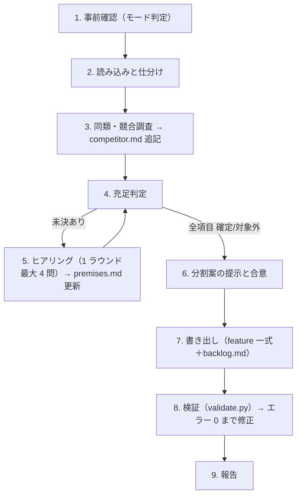
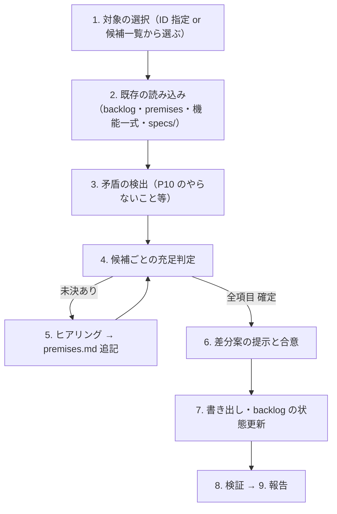

# speckit-concept-2-feature スキル（コンセプト → 機能概要への仕分け）

コアコンセプトを読み、**`/speckit-specify` に 1 回で渡せて、ユーザーストーリーで受入基準が書ける塊**に機能を仕分ける。
出力は `speckit-feature` / `speckit-all` スキルの入力（`docs/feature/spec_order.md` と `docs/feature/NNN-<slug>.md`）になる。
機能化しなかった候補は `docs/concept/backlog.md` に残し、後から同じスキルで機能化する（§6）。

## 0. 大原則

- **推測で埋めない。** 機能の根拠にしてよいのは、(a) concept のドメイン固有記述、(b) ユーザーの回答（`premises.md` に記録）の 2 つだけ。Web 調査の結果は**質問の選択肢と推奨案の材料**であり、ユーザーが採用して初めて根拠になる。
- **必須項目が全部埋まるまでヒアリングを続ける。** ラウンド数の上限は設けない。「なし」「対象外」とユーザーが明示した項目は埋まったものとして扱う。
- **concept 側で書き換えてよいのは、`competitor.md` への追記、`backlog.md` の作成・更新、`implementation-status.md` の作成・更新だけ。** 既存の記述は消さない・直さない（backlog の各候補の**状態欄の更新は可**）。それ以外の concept ファイルには触れない。
- **分割前に合意を取る。** 機能ファイルを書く前に分割案（一覧表）を提示し、承認を得る。
- ドキュメントは日本語で書く。識別子・パス・コマンドは原文のままでよい。

## 1. 引数・モードと出力

```text
$ARGUMENTS
```

- 第 1 引数: concept ディレクトリ。省略時は `docs/concept/`、なければ `docs/conpect/`（綴り揺れ）を探す。どちらもなければ質問する。
- 第 2 引数: 出力先。省略時は concept と同階層の `docs/feature/`。
- `--backlog [ID,…]`: backlog の候補を機能化する。ID を省略した場合は、状態が「候補」のものを一覧して AskUserQuestion で選んでもらう。

| 条件 | モード | 手順 |
|---|---|---|
| `docs/feature/` がない | **新規モード** | §2 |
| `docs/feature/` があり、`--backlog` なし | **再実行モード** | §2 を §5 の規則で行う |
| `docs/feature/` があり、`--backlog` あり | **バックログモード** | §6 |
| `docs/feature/` がなく、`--backlog` あり | 新規モードで進めてよいかを質問する | — |

| 出力 | 役割 |
|---|---|
| `docs/concept/competitor.md`（追記） | Web による同類・競合調査の結果。様式は [templates/competitor-research.md](./templates/competitor-research.md) |
| `docs/concept/implementation-status.md`（作成・更新） | 既存の実装がある場合のみ。実装の状況と、concept との差の記録（§2 ステップ 2） |
| `docs/concept/backlog.md`（作成・更新） | 機能化しなかった候補（候補 / 却下）と、機能化済みの記録。様式は [templates/backlog.md](./templates/backlog.md) |
| `docs/feature/premises.md` | 入力の仕分け、必須項目の充足状況、質疑の記録。様式は [templates/premises.md](./templates/premises.md) |
| `docs/feature/README.md` | 機能一覧と運用ルール。様式は [templates/readme.md](./templates/readme.md) |
| `docs/feature/spec_order.md` | 着手順序と段階分け。様式は [templates/spec_order.md](./templates/spec_order.md) |
| `docs/feature/NNN-<slug>.md` | 1 機能 1 ファイルの機能概要。様式は [templates/feature.md](./templates/feature.md) |

## 2. 手順



### ステップ 1: 事前確認

- §1 の表でモードを判定する。バックログモードなら §6 に進む。
- プロジェクトの規約ファイル（`CLAUDE.md`、`AGENTS.md`、`.kiro/steering/*`、`.specify/memory/constitution.md`）があれば読み、その規約に従う。

### ステップ 2: 読み込みと仕分け

concept 配下の全ファイルを読み、各記述を次の 3 つに分ける。結果は `premises.md` の「入力の仕分け」に書く。`backlog.md` はこの仕分けの対象外（候補の一覧であり、根拠ではない）。

| 分類 | 判定基準 | 扱い |
|---|---|---|
| **ドメイン固有** | そのサービス固有の利用者・業務・データ・制約を具体的に述べている | 機能の根拠にできる |
| **共通標準** | 複数アプリ共通のアーキテクチャ方針（例: `architecture.md`）や、共通基盤（例: `platform-core/packages/*`）が提供するもの | 機能にしない。「前提」として各機能から参照する |
| **テンプレート文** | 業種名を入れ替えても成り立つ汎用文（「業務効率化」「使いやすさ」「中小企業経営者」など） | 根拠にしない。ヒアリングで具体化する対象として記録する |

共通基盤があるかは、リポジトリ内の `platform-core/`、`packages/`、`templates/` や、architecture 文書の記述で確かめる。

**既存の実装がある場合**（`src/` などにアプリのコードがある場合）は、次も行う。

- 画面・Server Actions・スキーマ・認証・DB アクセスを読み、機能ごとに **実装済み / 一部実装 / 未実装** と、concept との差を `docs/concept/implementation-status.md` に書く（ファイルパスを添える）。技術基盤と共通標準（architecture 文書）との差も書く。
- 実装は根拠の 1 つとして扱うが、concept と食い違うときにどちらを正とするかはユーザーに確認する。
- 機能は「あるべき姿」で切り、実装の状況は各機能ファイルの「現状の実装」節と状態欄で表す（§3「状態」）。

**共通基盤がない場合も、コアドメイン以外の共通機能は機能にしない。** 認証、アカウント・プロフィール管理、招待、ロールと権限の仕組み、メール送信、通知、ファイル保存、監査ログ、運営者向けの管理画面、利用規約への同意と退会などが該当する。これらは `premises.md` の「共通基盤の候補」に、必要とする機能と根拠を添えて記録する。`speckit-common-feature` スキルが、この記録をもとに `docs/feature/000-app-basic.md` にまとめる。

### ステップ 3: 同類・競合調査

WebSearch / WebFetch で調べ、`competitor.md` の末尾に節を追記する（様式: [templates/competitor-research.md](./templates/competitor-research.md)）。

- **調査対象**: 直接競合（業界特化の同種サービス）3〜5 件、隣接（汎用の同機能サービス）1〜3 件、代替手段（紙・Excel・汎用ツール）。
- **調べること**: 主要機能、対象規模、価格帯と課金単位、差別化の打ち出し方、利用者の不満（レビュー・比較記事）、**業界の法規制・慣行**（保存義務、個人情報の区分、資格要件など）。
- **書き方の規則**:
  - 事実には出典 URL と参照日を付ける。出典のない価格・機能は書かない。
  - 機能比較表では各機能を **必須（多くの競合が持つ）／差別化候補／対象外候補** に分類する。これは提案であって決定ではない。
  - 既存の記述は消さない。再実行時は日付付きの新しい節を足す。
- 調査結果は次のステップのヒアリングで、選択肢と推奨案の材料として使う。

### ステップ 4: 充足判定

`premises.md` の必須項目表で各項目の状態を判定する。状態は **確定 / 対象外 / 未決** の 3 つ。

| ID | 項目 | 埋まったと言える状態 |
|---|---|---|
| P1 | 目的と中核価値 | 誰の、どの業務の、何を置き換えるかが 1〜2 文で言える |
| P2 | 利用者ロールと Workspace 方針 | ロールの一覧と各ロールの権限の概略、Workspace の単位（例: 1 院 = 1 Workspace）が決まっている |
| P3 | 主要業務フロー | ロールごとに、始点から終点までの流れが言える |
| P4 | 主要なドメインデータ | エンティティ名とその関係が言える（型・カラムは不要） |
| P5 | 外部サービス・連携 | 決済・通知・カレンダー・既存データの移行などの有無と相手が決まっている |
| P6 | 固有のセキュリティ・法規制 | 扱う個人情報の区分、保存期間・義務、アクセス制限の要否が決まっている |
| P7 | 固有のリソース要件 | ファイル添付・容量・バッチ・オフラインなどの有無が決まっている |
| P8 | MVP の範囲 | 最初の有料提供に必須の業務フローが決まっている |
| P9 | 課金・プランの境界 | 課金単位と、プランで機能差をつけるかが決まっている |
| P10 | 差別化とやらないこと | 競合に対する勝ち筋と、意図的にやらないことが決まっている |

- P2・P4・P5・P6・P7 は、共通 architecture 文書の「プロジェクト固有情報」欄に相当する。そこに記載があれば出典として使う。
- concept に具体的に書いてある項目はヒアリングしない（出典を記録して「確定」にする）。

### ステップ 5: ヒアリング

未決の項目があるかぎり、AskUserQuestion でラウンドを繰り返す。

- 1 ラウンド最大 4 問。聞く順序は **P1 → P2 → P3 → P4 を優先**する（後の項目の選択肢がこれらで決まるため）。
- 各問に選択肢を 2〜4 個付け、推奨案を先頭に `(Recommended)` 付きで置く。調査を根拠にした選択肢には、説明に「競合 X・Y が採用」のように出典を添える。
- 回答から新しい論点が出たら（例: 回数券販売 → 決済連携が必要）、該当項目を「未決」に戻すか項目を足し、次のラウンドで聞く。
- **ラウンドを終えるたびに `premises.md` を更新する**（充足状況表と質疑記録）。途中で中断しても再開できるようにするため。
- 質疑記録は実行ごとに `### 初回の仕分け（日付）` のような小見出しでまとめ、各質問は `#### Q<n>（ラウンド n）— <項目 ID>` で書く（様式は [templates/premises.md](./templates/premises.md)）。
- 「全部埋まるまで続ける」が原則。ユーザーが明示的に「この項目は後で決める」と言った場合に限り、その項目を未決のまま進めてよい。その場合は該当する機能ファイルの「スコープ外」または `/speckit-clarify` で決める事項として書き、検証スクリプトの警告を報告に含める。
- 調査で挙がった候補のうち、ヒアリングで採否を聞かなかったものは、分割案で「backlog の候補」として提示する（勝手に機能にも却下にもしない）。

### ステップ 6: 分割案の提示と合意

§3 の分割ルールに従って分割案を作り、次の 4 つをまとめて提示する。

1. **機能一覧表**: `# | ファイル名（NNN-slug） | 名称 | 区分 | 依存 | 一言 | 根拠（P-ID / Q-ID）`
2. **機能にしないもの**: 共通基盤が提供するため前提として扱うもの、および「共通基盤の候補」（`000-app-basic` に渡すもの）
3. **backlog の候補**: 調査などで挙がったが、今回は機能化しないもの（採否を聞いていないもの、後で検討とされたもの）
4. **backlog の却下**: ユーザーが「やらない」「採用しない」と決めたもの（理由と Q-ID）

AskUserQuestion で「この案で書き出す / 修正する」を確認し、修正があれば直して再提示する。合意するまで書き出さない。

### ステップ 7: 書き出し

テンプレートに沿って `premises.md`（最終版）、`NNN-<slug>.md` 群、`README.md`、`spec_order.md`、`docs/concept/backlog.md` を書く。

- `spec_order.md` の各機能行は **`- **N. [名称](./NNN-slug.md)**` の形を厳守する**。`speckit-worktree` の worktree_helper.py がこの行を読み、ファイル名 `NNN-slug` をそのまま `specs/NNN-slug` とブランチ名に使うため。
- `N`、ファイル名の `NNN`、各機能ファイルの `**想定順序**` の 3 つを一致させる。
- `backlog.md` がすでにあれば、既存の候補は残し、新しい候補を次の BL 番号から足す。
- `premises.md` の「見送った機能」は `backlog.md` を正本とし、premises には参照だけを書く。

### ステップ 8: 検証

```bash
python3 <このスキルのディレクトリ>/scripts/validate.py <出力先の docs/feature>
python3 <このスキルのディレクトリ>/scripts/validate.py <出力先の docs/feature> --graph
```

- エラーが 0 件になるまで直す。警告は内容を確認し、意図どおりなら報告に書く。
- `backlog.md` は `docs/feature` と同階層の `concept/`（または `conpect/`）から自動で見つけて検証する。別の場所にある場合は `--backlog-file <パス>` で指定する。
- `--graph` は、`spec_order.md` にそのまま貼れる Markdown（被参照数の表と、段階ごとの機能行）を出す。被参照数の表はこの出力で置き換え、「意味」の列は既存の記述が引き継がれるので、新しい行だけ書き足す。段階の見出し（`<段階の性格>`）と mermaid 図は手で付ける。
- 通常の検証でも、`spec_order.md` の被参照数の表が実測と違えば警告を出す。
- `README.md` と `spec_order.md` には **実行コマンドだけ**を書く（スクリプト本体は埋め込まない）。コマンド中のパスは、プロジェクト内にこのスキルの配置（`.agents/skills/…` または `.claude/skills/…`）があればその相対パス、なければこのスキルの絶対パスにする。

### ステップ 9: 報告

次の内容を日本語で報告する。

- 作成・更新したファイル（`competitor.md` と `backlog.md` を含む）
- 機能数（MVP / 拡張の内訳）と着手順の先頭 3 件
- backlog の件数（候補 / 却下）
- 検証結果（エラー件数・警告件数、警告の内容）
- 未決のまま残した項目があればその一覧

## 3. 分割ルール

### 分割の軸

- **縦割りを基本にする。** 1 機能は「あるロールが 1 つの価値を得る」単位にまとめ、その価値に必要なデータ・業務ロジック・画面を含める（例: 「予約受付」「施術記録（カルテ）」）。
- **横割りの基盤機能は、次の 2 種類に限って作る。**
  1. **アプリ固有の組み込み**: 共通基盤をこのアプリに合わせる部分（例: 院のロールと権限、Workspace とドメインデータの結びつけ、初期設定）
  2. **複数機能が共有するドメインの核**: 2 つ以上の縦割り機能が同じ実体を前提にするもの（例: 患者マスタ、メニュー・料金マスタ）
- **共通基盤が提供するものは機能にしない**（認証方式、セッション、Queue、Storage、ロギング、CSM 管理者など）。各機能の「前提・設計原則との関係」から参照する。
- **共通基盤がなくても、コアドメイン以外の共通機能は機能にしない。** `premises.md` の「共通基盤の候補」に記録し、`000-app-basic`（`speckit-common-feature` が作る）に任せる。ドメイン固有のロールや初期設定（上の「アプリ固有の組み込み」）は、これまでどおり機能にしてよい。
- データ基盤の一括機能（全エンティティをまとめた「データ永続化基盤」）は作らない。エンティティは、それを主に作る機能か、ドメインの核の機能が持つ。

### サイズの目安

- 優先度 P1 のユーザーストーリーが 1〜3 本で、それぞれに受入基準が書けること。
- **分割する**: P1 ストーリーが 4 本以上になる、ロールが 3 種類以上またがる、MVP と拡張が混ざる。
- **統合する**: 単独ではユーザーストーリーが立たない（画面 1 つ・設定 1 項目だけなど）、常に別の機能と同時にしか使われない。

### 区分（MVP / 拡張）

- **MVP**: P8（MVP の範囲）に含まれる業務フローを実現するのに必要な機能と、それが依存する機能。
- **拡張**: それ以外で、今回機能化すると合意したもの。P9（プランの境界）・P10（差別化）を根拠に、上位プランや後続リリースに回すもの。
- 今回機能化しないものは拡張ではなく **backlog の候補**にする。
- **MVP の機能は拡張の機能に依存してはならない**（検証スクリプトでエラーになる）。
- 区分の判断根拠は、各機能ファイルの「根拠」節に書く。

### 状態

| 状態 | 意味 |
|---|---|
| `未着手` | spec も実装もない |
| `実装済み（spec なし）` | spec はないが、機能の主な要求を満たす実装がある |
| `一部実装（spec なし）` | spec はなく、主な要求の一部だけが実装されている |
| `spec化済み（specs/NNN-slug）` | `/speckit-specify` 以降に進んだ。以後の正本は `specs/` |
| `完了` | spec に沿った実装が完了した |

- `実装済み（spec なし）`・`一部実装（spec なし）` の機能ファイルには、「現状の実装」節を必ず書く（実装済みの要求、未実装の要求、concept との差、コードの場所）。
- これらの機能を spec 化するときは、「現状の実装」を `/speckit-specify` の入力に含め、既存コードを踏まえた spec にする。

### 依存

- `**依存**` には、その機能の spec 化・実装に**先に必要な**機能の**完全名**（`NNN-slug`、例: `001-clinic-setup`）をカンマ区切りで書く。なければ `—`。
- 「あると便利」程度の関係は依存にせず、「位置づけ」に書く。
- 循環依存は作らない。

### ファイル名・番号・名称

- ファイル名は **`NNN-<slug>.md`**（例: `001-clinic-setup.md`）。`NNN` は 3 桁ゼロ埋めの想定順序で、`specs/NNN-slug` とブランチ `feature/NNN-slug` にそのまま対応する。
- **`000` と `999` は予約番号で、このスキルでは使わない。** `000-app-basic`（共通基盤）は `speckit-common-feature` が、`999-app-nfr`（運用基盤・非機能要件）は `speckit-nfr-feature` が作る。このスキルが振る番号は `001` から `998` まで。
- 再実行モードやバックログモードで `000` や `999` のファイルがすでにある場合は、それらを書き換えない。ただし、新しい機能の依存には `000-app-basic` を加え、`spec_order.md` では `000` を先頭に保つ。
- slug は英小文字のケバブケース、2〜4 語、価値を表す名詞句（例: `appointment-booking`、`treatment-chart`、`clinic-roles-and-setup`）。
- **番号は初回に着手順で振り、以後は固定する。** 後から足す機能は既存の最大値の次から振る。後から足した機能を既存の未着手機能より先に着手する場合でも番号は変えず、着手順は `spec_order.md` の並び順で表す。
- 本文中でほかの機能に触れるときも完全名（`` `003-appointment-book` ``）で書く。
- 名称（H1）は日本語で、README 一覧のリンク文言と一致させる。

## 4. 記述の粒度（広く浅く）

- **書く**: 目的、利用ロール、主な要求の箇条書き、主なエンティティ名、他機能との境界（スコープ外）、根拠。
- **書かない**: カラム名と型、API のパスとメソッド、数値パラメータ（閾値・上限・時間）、画面レイアウト、ライブラリ選定。これらは `/speckit-clarify` と `/speckit-plan` で決める。
- ただし、ユーザーが回答で具体値を決めた場合（例: 「予約枠は 15 分単位」）は、要求として書いてよい。出典として Q-ID を付ける。
- 検証スクリプトは、型名や API パスらしい記述を警告として報告する。
- backlog の「要件概要」も同じ粒度で書く。

## 5. 再実行モード

- 既存の `premises.md` を読み、回答済みの項目は引き継ぐ。concept が更新されていれば、差分に関わる項目だけ「未決」に戻す。
- 調査は日付付きの新しい節として `competitor.md` に足す。
- 既存の機能に対する **追加・分割・統合・区分変更** の差分案を表で示し、承認されたものだけ反映する。
- `**状態**` が `spec化済み（…）` 以降の機能ファイルは変更しない。正本は `specs/` 側にあるため。分割・統合が必要に見えても、提案に留めて報告する。
- **既存の番号（ファイル名と `想定順序`）は振り直さない。** 新しい機能には、既存の最大値の次から番号を振る。
- 新しく見つかった候補は `backlog.md` に足す。

## 6. バックログモード（`--backlog`）

`docs/concept/backlog.md` の候補を、既存の `docs/feature/` に機能として足す。



1. **対象の選択**: 引数の ID を使う。省略時は状態が「候補」のものを一覧し、AskUserQuestion（複数選択）で選んでもらう。状態が「却下」「機能化済み」の ID が指定された場合は、進めてよいかを先に確認する。
2. **既存の読み込み**: 対象の候補、`premises.md`、`docs/feature/` 一式、`specs/` の有無を読む。concept の新しい記述があれば §2 ステップ 2 と同じ基準で仕分けに足す。
3. **矛盾の検出**: 候補が premises の決定（特に P10「やらないこと」、P5 連携、P6 規制、P9 プラン）と食い違う場合は、先に「決定を改めるか / 候補を却下するか」を質問する。決定を改めたときは、premises の該当 P 項目を更新し、Q-ID で履歴を残す。
4. **候補ごとの充足判定**: 次の項目を判定する。backlog の「機能化するときに決めること」を最初の論点にする。

   | ID | 項目 | 埋まったと言える状態 |
   |---|---|---|
   | B1 | 利用ロールと得る価値 | 誰がこの機能で何を得るかが言える |
   | B2 | 業務フロー | 始点から終点までの流れが言える |
   | B3 | データ | 新しいエンティティと、既存エンティティとの関係が言える |
   | B4 | 既存機能への影響 | 依存先、既存の未着手機能に足す要求や依存があるかが言える |
   | B5 | 区分 | MVP か拡張か（原則は拡張。MVP にする場合は P8 を更新する） |
   | B6 | 連携・規制・リソース | 新しい外部連携、個人情報、ファイル、バッチの有無が言える |

   必要なら競合調査を日付付きの新しい節として `competitor.md` に足す。
5. **ヒアリング**: §2 ステップ 5 と同じ規則で行う。Q-ID は既存の最大値の次から振る。`premises.md` の質疑記録には、`### BL-NNN の機能化（日付）` の小見出しを 1 つ作り、その下に対象・結果の要約と各質問（`####`）を書く。複数の ID をまとめて機能化するときは、ID ごとに小見出しを分ける。
6. **差分案の提示と合意**: 次の 3 つを示し、承認を得る。
   - 追加する機能（番号は既存の最大値の次から。1 つの候補を複数の機能に分けてもよい）
   - 既存の機能への変更（状態が「未着手」のものに限る。要求・依存・スコープ外の追記）。`spec化済み` 以降に影響する場合は、変更せずに影響の内容を報告する
   - `spec_order.md` の並び順の変更
7. **書き出しと状態更新**: 新しい機能ファイルを書き、承認された既存ファイルの変更、`README.md` の一覧、`spec_order.md` を更新する。backlog の候補の状態を `機能化済み（docs/feature/NNN-slug.md）` にする。新しく出た候補は backlog に足す。
8. **検証と報告**: §2 ステップ 8・9 と同じ。報告には、機能化した候補の ID と作った機能のファイル名を含める。

## 7. 禁止事項

- concept のファイルを、`competitor.md` への追記と `backlog.md` の作成・更新以外で書き換えること
- `backlog.md` の既存の候補を消すこと（状態を変えるだけにする）
- 出典のない調査結果（価格・機能・法規制）を書くこと
- ユーザーの合意なしに機能ファイルを書き出すこと、または既存ファイルを上書きすること
- `spec化済み` 以降の機能ファイルを書き換えること
- 既存の機能の番号を振り直すこと
- 検証スクリプトの本体を出力ファイルに埋め込むこと
