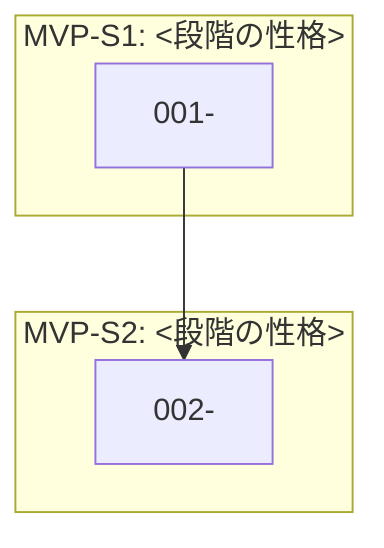

# 推奨仕様化順

`docs/feature/` の全機能を、**区分（MVP → 拡張）と依存関係で並べた `/speckit-specify` に渡す順序の目安**。

> ⚠ **このファイルは進捗を持たない。** 進捗は各機能ファイルの状態欄と `specs/<機能>/tasks.md` が正本。
> 各行の番号 `N` とファイル名の `NNN` は想定順序（採番）で、`speckit-feature` / `speckit-coding` / `speckit-all` が `specs/NNN-<slug>` の番号として使う。**振り直さない。**

## この順序の作り方

各機能ファイルの `**区分**` と `**依存**` を読み、MVP を先に、それぞれの中を依存の段階順に並べた。
被参照数と段階分けは次のコマンドで再現できる。

```bash
python3 <validate.py のパス> docs/feature --graph
```

### 被参照数の多い順（律速要素）

| 被参照 | 機能 | 意味 |
|---|---|---|
| <n> | `<NNN-slug>` | <なぜ多くの機能の土台になるか> |

## 段階分け



### MVP

#### MVP-S1: <段階の性格>

- **1. [<機能名>](./001-<slug>.md)**: <一言>

#### MVP-S2: <段階の性格>

- **2. [<機能名>](./002-<slug>.md)**: <一言>

### 拡張

#### 拡張-S1: <段階の性格>

- **<N>. [<機能名>](./<NNN>-<slug>.md)**: <一言>
