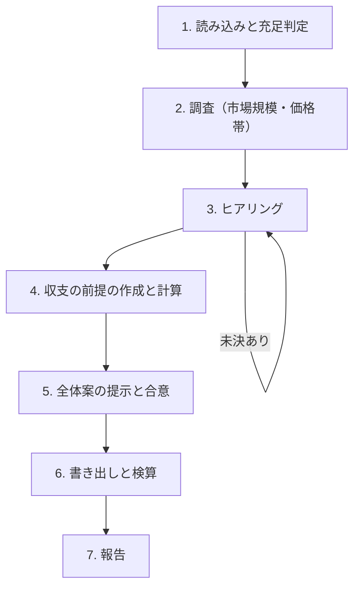

# speckit-project スキル（事業計画 → docs/project.md）

市場、価格と収支、KPI、スケジュール、体制、リスクを決め、事業計画の正本 `docs/project.md` に書く。企画書（`speckit-presentation`）は、この文書をもとに作る。

## 0. 大原則

- **推測で埋めない。** 根拠にしてよいのは、(a) プロジェクトの成果物（concept、premises、機能、architecture、nfr）、(b) ユーザーの回答、(c) 出典付きの調査結果の 3 つだけ。
- **客観的な数字は調べ、判断は聞く。** 市場規模、事業所数、競合の価格などは Web で調べ、出典 URL と参照日を付ける。目標、価格の決定、投資額、体制、スケジュールの制約など、判断が要るものはユーザーに質問する。調査の結果は、質問の選択肢と推奨案の材料にする。
- **ほかの文書の正本を書き換えない。** 目的と差別化、MVP の範囲、課金の方式は `premises.md`、競合は `competitor.md`、インフラ費用は `architecture.md`、コストの上限は `nfr.md` が正本である。`project.md` からは参照するだけにする。食い違いが見つかったら、どちらを直すかをユーザーに確認し、正本側は該当するスキルの更新モードで直すよう案内する。
- **収支は計算させる。** 収支の数字は手で書かず、前提のブロックから `plan.py` で計算する。
- **幅を持たせる。** 収支は楽観・標準・悲観の 3 シナリオ、工数と期間は最小〜最大の範囲で示す。
- **書き出す前に合意を取る。**
- ドキュメントは日本語で書く。

## 1. 引数と入出力

```text
$ARGUMENTS
```

| 入力 | 用途 | ない場合 |
|---|---|---|
| `docs/concept/`（`competitor.md` を含む） | 目的、利用者、競合の価格帯 | 必須。なければ停止して、コアコンセプトを書くよう案内する |
| `docs/feature/premises.md` | P1 目的、P8 MVP の範囲、P9 課金の方式、P10 差別化 | 該当する項目をヒアリングで補う |
| `docs/feature/*.md`、`spec_order.md` | 工数の見積もりとスケジュール | 工数とスケジュールを「未決」にし、`speckit-concept-2-feature` を案内する |
| `docs/architecture.md` | インフラ費用 | インフラ費用をヒアリングの概算にし、`speckit-architecture` を案内する |
| `docs/nfr.md` | コストの上限（NFR-CT）、運用の体制 | 参照しない |

| 出力 | 様式 |
|---|---|
| `docs/project.md` | [templates/project.md](./templates/project.md) |

`docs/project.md` がすでにある場合は、**更新モード**として §4 に従う。

## 2. 手順



### ステップ 1: 読み込みと充足判定

入力を読み、次の項目の状態を **確定 / 対象外 / 未決** で判定する。成果物に根拠がある項目は、出典を記録して「確定」にする。

| ID | 項目 | 埋まったと言える状態 |
|---|---|---|
| J1 | 目指す姿と計画期間 | 何年で、どこまでの事業にするかが言える |
| J2 | 市場規模 | TAM・SAM・SOM の定義と規模が、出典か算出方法付きで言える |
| J3 | ターゲットと獲得経路 | 主な顧客像とその数、主な獲得経路が言える |
| J4 | 価格 | プランごとの価格と課金単位が決まっている |
| J5 | 収支の前提 | シナリオごとの顧客数の推移、主な費用（インフラ、人件費、広告、手数料）、初期投資が決まっている |
| J6 | 資金 | 必要資金の調達方法（自己資金、借入、出資）が決まっている |
| J7 | KPI と判断基準 | 主な KPI、目標と時期、見直しと撤退の基準が決まっている |
| J8 | スケジュール | 主なマイルストーンと、その時期の幅が言える |
| J9 | 体制 | 役割、担当、稼働できる時間、外部委託の有無が決まっている |
| J10 | リスク | 主なリスクと対策が言える |

### ステップ 2: 調査

WebSearch と WebFetch で、J2・J3・J4 の材料を調べる。

- 市場規模: 公的統計（事業所数、世帯数など）、業界団体や調査会社の公表値。定義（何を数えた値か）と年を必ず確かめる。
- ターゲットの数と獲得経路: 対象となる事業者や利用者の数、よく使われる集客の経路。
- 価格: `competitor.md` の価格帯を使い、足りなければ追加で調べる（新しい調査は `competitor.md` ではなく `project.md` の出典に書く）。
- 事実には出典 URL と参照日を付ける。出典のない数字は書かない。数字がどうしても見つからない場合は、算出方法（フェルミ推定など）と、その前提をユーザーに確認して書く。

### ステップ 3: ヒアリング

未決の項目があるかぎり、AskUserQuestion でラウンドを繰り返す。

- 1 ラウンド最大 4 問。聞く順序は **J1 → J4 → J9 → J5** を優先する（価格と体制が決まらないと、収支の前提が決まらないため）。
- 各問に選択肢を 2〜4 個付け、推奨案を先頭に `(Recommended)` 付きで置く。調査を根拠にした選択肢には、説明に出典を添える。
- 数値を決める質問（価格、目標の顧客数など）では、調査にもとづく範囲と、その範囲にした理由を示す。
- 回答は `project.md` の「ヒアリングと調査の記録」に、`PJ-Q<n>` の ID で記録する。途中で中断しても再開できるよう、ラウンドごとに書き足す。
- ユーザーが「後で決める」とした項目は「未決の項目」に書き、その項目に依存する部分（収支など）は暫定値であることを明記する。

### ステップ 4: 収支の前提の作成と計算

1. テンプレートの `json speckit-plan` ブロックに、シナリオごとの前提を書く。
   - `revenue`: 収益の項目ごとに、月額の単価（`unit_price`）と、期中の平均の数量（`volume`）
   - `costs`: 月額の固定費（`monthly`）、期ごとの費用（`per_period`）、売上に対する率（`rate`）のいずれか
   - `initial_investment`: 初期投資
   - インフラ費用は `architecture.md` の概算を使い、人件費は §7 の体制から求める。
2. 計算する。

   ```bash
   python3 <skills>/speckit-project/scripts/plan.py docs/project.md --write
   ```

   `<skills>` は、このスキルが置かれた skills ディレクトリである。`python3` がない環境では `python` または `py -3` に読み替える。
3. 結果を確かめる。
   - インフラ費用が `nfr.md` のコストの上限（NFR-CT）を超えていないか
   - 必要資金が、ステップ 3 で聞いた調達の方法で賄えるか
   - 黒字化の時期が、J1 の計画期間に収まるか

   収まらない場合は、前提（価格、目標、費用）を見直すかをユーザーに確認する。

### ステップ 5: 全体案の提示と合意

次をまとめて提示し、承認を得る。

1. 市場規模（TAM・SAM・SOM）と、その出典
2. 価格と、その根拠
3. 収支の要約（シナリオごとの黒字化の時期、必要資金）
4. KPI と、見直し・撤退の基準
5. マイルストーンと、その時期の幅
6. 体制と、主なリスク
7. 未決の項目と、ほかの文書との食い違い（あれば）

### ステップ 6: 書き出しと検算

1. [templates/project.md](./templates/project.md) に沿って `docs/project.md` を書く。
2. 検算して、収支表が前提と一致していることを確かめる。

   ```bash
   python3 <skills>/speckit-project/scripts/plan.py docs/project.md --check
   ```

### ステップ 7: 報告

- 市場規模、価格、標準シナリオの黒字化の時期と必要資金
- KPI と判断基準の要約
- マイルストーンの時期の幅
- 未決の項目と、ほかの文書との食い違い
- 次の手順の案内（`speckit-presentation` で企画書にする）

## 3. 記述の規則

- **工数の見積もり**: `spec_order.md` の機能ごとに、主な要求の量と外部連携の有無から、人日を最小〜最大で見積もる。見積もりの根拠を 1 行で書く。期間は、工数の合計を体制の稼働できる時間で割って求める。
- **KPI**: 計測できるもの（件数、率、金額）にし、計測方法を書く。目標には時期を付ける。見直しと撤退の基準は、目標とは別に書く。
- **収支表**: `speckit-plan:begin` と `speckit-plan:end` の間は `plan.py --write` だけが書く。手で直さない。
- **金額**: 通貨の単位を書く。税込か税抜かを「前提の根拠」に書く。

## 4. 更新モード

`docs/project.md` がすでにある場合は、次のように進める。

1. 既存の内容と、見直しのきっかけ（引数、機能やアーキテクチャの変更、実績値など）を確かめる。
2. 成果物の変更で影響を受ける部分を洗い出す（例: 機能が増えた → 工数とスケジュール、構成が変わった → インフラ費用と収支）。
3. 変える部分と、その影響を示し、合意した変更だけを反映する。
4. 収支の前提を変えたら `plan.py --write` で計算し直し、`--check` で確かめる。
5. 「変更履歴」に日付、内容、理由を足す。

## 5. 禁止事項

- 出典のない市場規模、統計、価格を書くこと
- 収支の数字を手で書くこと（`plan.py` の計算結果を使う）
- ほかの文書の正本（premises、competitor、architecture、nfr）を、このスキルで書き換えること
- ユーザーの合意なしに `docs/project.md` を書き出す、または上書きすること
